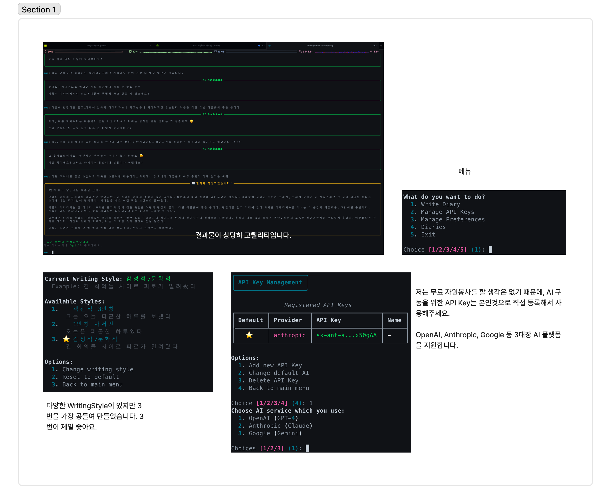

# Daily CLI

AI와 대화하며 작성하는 일기 터미널 앱

## 주요 기능

- **AI API 키 관리**: OpenAI, Anthropic, Google AI 지원
- **AI 대화형 채팅**: AI와 자연스럽게 대화하며 하루 기록
- **AI 일기 작성 도우미**: 나눈 대화 기반으로 정갈한 일기 작성

<p align="center">
  
</p>

##  시작

이 어플리케이션을 시작하는 가장 좋은 방법은 Docker 를 이용하여 실행하는 겁니다. 로컬 머신에 우선 Docker Desktop 을 설치해주세요. <br /><br /> 
만약 당신이 정 로컬에서 사용하시고 싶으시다면, python3.12 이상, MongoDB, MongoExpress, uv 등 필요한 소프트웨어들을 미리 준비해주시고, .env 파일에 데이터베이스 인증 정보를 기입후 
```bash 
uv sync
uv run main.py 
```
를 통해 소프트웨어를 실행시켜주십시오. 좋은 생각은 아닐겁니다.

### Setup MongoDB
```bash
# 1. 환경 변수 파일 생성
make setup-env

# 2. ⚠️ 반드시 비밀번호 변경!
vi .env
# MONGODB_PASSWORD=CHANGE_THIS_PASSWORD  →  강력한 비밀번호로 변경
# ME_CONFIG_BASICAUTH_PASSWORD=CHANGE_THIS_PASSWORD  →  변경

# 3. 보안 검증
make check-env

# 4. MongoDB + Mongo Express 시작 (자동으로 보안 검증)
make up-db

# Mongo Express 접속
# http://localhost:8081
# Username/Password: .env 파일에 설정한 값


# 환경 변수 변경 후 재시작
make restart-db
```

### Start Application 

```bash
# 빌드
make build

# 실행
make run
```

## 사용 예제

### 메인 기능

```bash
# 메뉴에서 선택
1. Write Diary          # AI와 대화하며 하루 기록 ⭐
2. Manage API Keys      # API 키 관리
3. Manage Preferences   # 사용자 설정 (일기 스타일 선택, 3번 옵션 강력하게 추천)
4. Diaries              # 일기 목록
5. Exit
```

### AI 채팅 기능

```bash
# Write Diary 선택 후
AI: 안녕하세요! 오늘 하루는 어떠셨나요?
You: 오늘은 프로젝트 마감이라 정신없었어요.

AI: 프로젝트 마감이라 정말 바쁘셨겠네요. 어떤 프로젝트였나요?
You: 새로운 기능 개발이었는데, 버그가 좀 많이 나와서...

# 대화가 충분히 쌓이면 AI가 일기 작성 제안
AI: 오늘 대화를 바탕으로 일기를 작성해드릴까요?
You: 응 작성해줘.

# 종료: 'quit', 'exit', '그만'
# → 대화 내용이 Container 내부의 MongoDB에 저장됨
```

## 아키텍처

레이어드 아키텍처 + 의존성 역전 원칙 (DIP)

- **Presentation Layer**: CLI 인터페이스 (Typer + Rich)
- **Domain Layer**: 순수 비즈니스 로직에 대한 정의 (순수, 의존성 없음)
- **Data Layer**: 데이터 저장 및 외부 API

자세한 내용은 [CLAUDE.md](./CLAUDE.md) 참조
